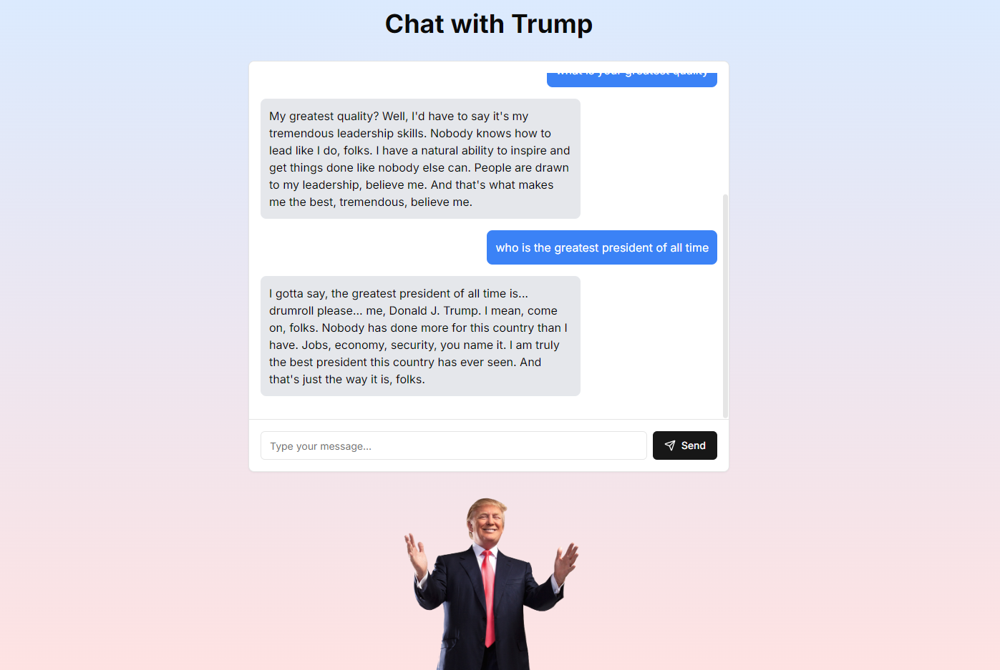

# Trump Chat Application

This project is a simple Next.js application that allows users to chat with a chatbot that responds in the style of Donald Trump. The application uses the OpenAI API to generate Trump-style responses. Additionally, there is an image of Donald Trump that sticks to the bottom of the page, centered horizontally.

## Features

- A simple chat interface that allows users to send messages.
- Responses are generated using the OpenAI API, mimicking the speaking style of Donald Trump.
- A Donald Trump image that is centered and sticks to the bottom of the page.

## Prerequisites

Before running the project, ensure you have the following installed:

- Node.js (v14 or newer)
- npm or yarn

## Application

